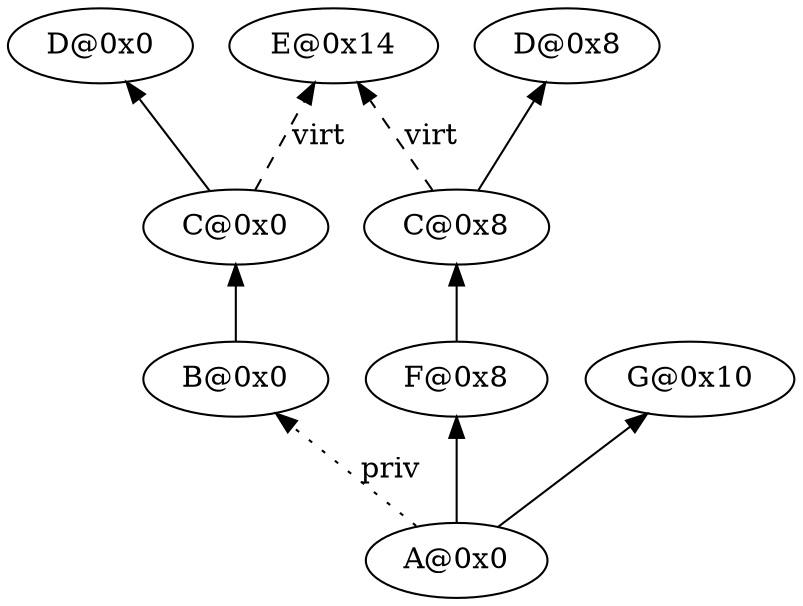

# RTTI and dynamic_cast

To explain RTTI(Run-Time Type Information), especially in the context of MWCC, the main thing to first understand is `dynamic_cast`. RTTI is what makes it possible to figure out what the most derived type behind any pointer or reference to a polymorphic type is, and the difference in how Itanium and MWCC implement it respectively is stark.

So first up: let's review `dynamic_cast`! (feel free to skip this next section if you already know the ins and outs)

## Dynamic cast overview

`dynamic_cast` is the mechanism the standard provides to take a pointer or reference to a base class and cast it to the corresponding instance of a derived class(direct downcast) or a sibling base class(crosscast), as long as said cast is unambiguous and occurs through only public inheritance paths. Casts from derived to base and other such cases are resolved at compile-time(essentially turned into `static_cast`). Runtime checks using RTTI are only required for down- and crosscasts, so those are what we concern ourselves with.

The standard wording describing which casts are allowed and which are considered ambiguous is [a bit dense](https://eel.is/c++draft/expr.dynamic.cast), but describes an in essence simple algorithm for determining when a specific `dynamic_cast` is valid.

For `dynamic_cast<Target*>(src)`, with `src` being a pointer of type `SrcType*` pointing to a base subobject of an object of the Most-Derived Type(`MDType`), the base of the hierarchy, it tries to find a subobject of type Target to cast in two traversals through the inheritance hierarchy of MDType: one from SrcType down to MDType following inheritance links in reverse, and if that fails to find a Target subobject and SrcType is a public base of MDType, a second walk up from MDType through the rest of the hierarchy.

In both traversals, if a Target subobject is found, the following two conditions need to be met for the cast to succeed, and it'll fail (early in the case of the downcast check) if either of them is not:

1. Exactly one Target subobject needs to be found during the walk, otherwise there's no obvious answer as to which is the intended cast target.
1. The Target subobject needs to be reachable from the start of the walk through a chain of public inheritance links. dynamic_cast is not allowed to cross private inheritance boundaries.

Note that these requirements are orthogonal: if a second Target subobject is found through a private path, it still counts as a duplicate.

To illustrate the rules, here's an inheritance diagram that has most cases covered, with subobjects marked using their concrete offset to easily tell ambiguous bases apart:

Interesting downcasts to look at:

- `D@0x0` **can** be cast to `B`(`B@0x0`) and `C`(`C@0x0`) since there's a chain of public inheritance between them.
- Similarly, `D@0x8` **can** be downcast to `C`(`C@0x8`), `F`(`F@0x8`), and `A`(`A@0x0`) because of the chain of public inheritance.
- `B@0x0`, `C@0x0` and `D@0x0` **can't** be cast to `A` since they have a private inheritance edge on their path to `A@0x0`.
- `E@0x14` **can't** be cast to `C` since there's two subobjects of type `C` on paths from it to `A@0x0`.
- However, `E@0x14` **can** be cast to `F`(`F@0x8`) and `A`(`A@0x0`) because of the path through `C@0x8` being all public inheritance.

As for the crosscasts:

- None of `B@0x0`, `C@0x0` or `D@0x0` get to participate in any crosscasts(to or from) because of the private inheritance edge on the single path to `A@0x0`.
- nothing can be crosscast to either `C` or `D` since they're ambiguous bases of `A`.
- `G@0x10` **can** be crosscast to `F`(`F@0x8`) and `E`(`E@0x14`) because of the public inheritance from `A@0x0` to both.
- `E@0x14`, `F@0x8`, `C@0x8` and `D@0x8` **can** be crosscast to `G`(`G@0x10`) for the same reason.

This algorithm is quite slow(and expensive data-wise) to implement as written, and different compilers have found different ways of speeding it up.

## Itanium

This section is an overview based on the [Itanium docs](https://itanium-cxx-abi.github.io/cxx-abi/abi.html#rtti-layout) and [gcc's implementation of `dynamic_cast`](https://gcc.gnu.org/git/?p=gcc.git;a=blob;f=libstdc%2B%2B-v3/libsupc%2B%2B/dyncast.cc;h=cdfe677c1922537d0ff6ae0c86a4011674a995b9;hb=6a2eb23e0e2d0aa65a38869aee56406aa48c7fae). For more detailed information, check those sources.

### RTTI

Itanium's RTTI approach is to use subclasses of `std::type_info` to capture specific information about all possible targets of `typeid`. The ones we're interested in here are responsible for capturing info about class types. Those being `abi::__class_type_info`, `abi::__si_class_type_info` and `abi::__vmi_class_type_info`. The latter two are derived from `abi::__class_type_info` and model different types of inheritance scenarios(while `abi::__class_type_info` is just a direct derived class of `std::type_info` with nothing added).

`abi::__si_class_type_info` is used for classes that have a single public non-virtual base and holds just a pointer to its base's `abi::__class_type_info`.

`abi::__vmi_class_type_info` is used for all other cases, containing a flags field indicating some properties about the hierarchy and an array of info on the class' direct bases. This info consists of a pointer to the base's `abi::__class_type_info`(of course), alongside flags indicating whether the inheritance is public and/or virtual.

### libstdc++ dynamic_cast

`libstdc++` implements `dynamic_cast` using a tree walk through the different `abi::__class_type_info` instances of the hierarchy, starting at the most-derived type, trying to find both the source of the cast and all subobjects of the target type. While it's doing this, it keeps track of the properties of three important inheritance paths: most-derived to the source, most-derived to target, and target to source. Said properties are flags indicating whether the inheritance relationship is public, private, none at all or ambiguous.

It employs several techniques to shortcut this walk whenever possible, a few of the notable ones being:

1. `abi::__si_class_type_info` has the ability to have a very simple implementation, checking itself against the target and source's class (and exact subobject pointer in the case of source) and updating the paths accordingly.
1. If the target class has a single instance of the source's class as one of its bases, the compiler inserts an argument giving `dynamic_cast` the offset between the two, allowing the walk to shortcut when it reaches the target class by checking if that offset causes it to hit the source pointer directly.
1. This works the other way as well, and in the multiple-inheritance scenario, that offset can be used to work backwards from the source pointer to detect bases that can't possible contain the target and source(in the case of a downcast `dynamic_cast`).
1. `abi::__vmi_type_info`'s hierarchy shape info field is also used to rule out several scenarios and short-circuit out.
1. Find the source pointer to be a private non-virtual base subobject, which because of the tree walk itself means all direct downcast scenarios have been considered and not found.

In short, a whole bunch of machinery to try and early-detect the happy path(find the target pointer that has a public path to the source subobject without ambiguity) or evidence of ambiguity, at which point it can also error out early.
