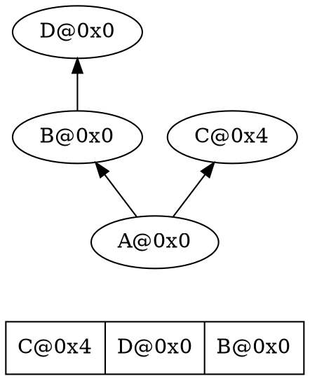
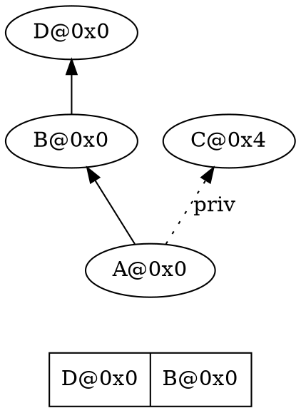
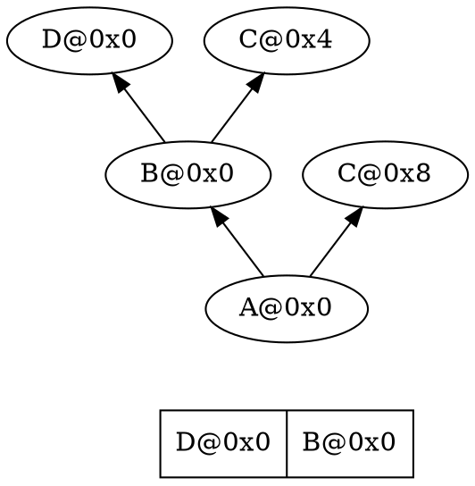
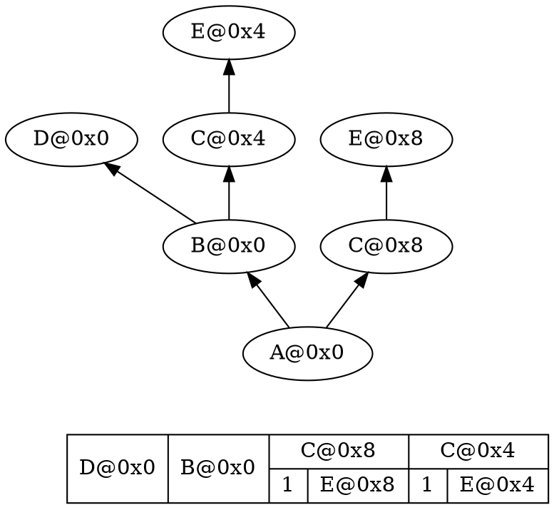
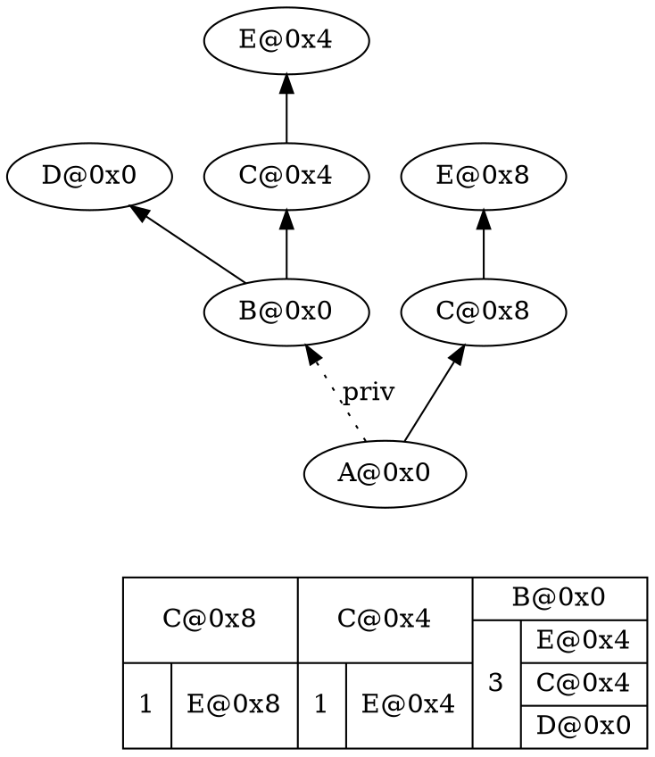
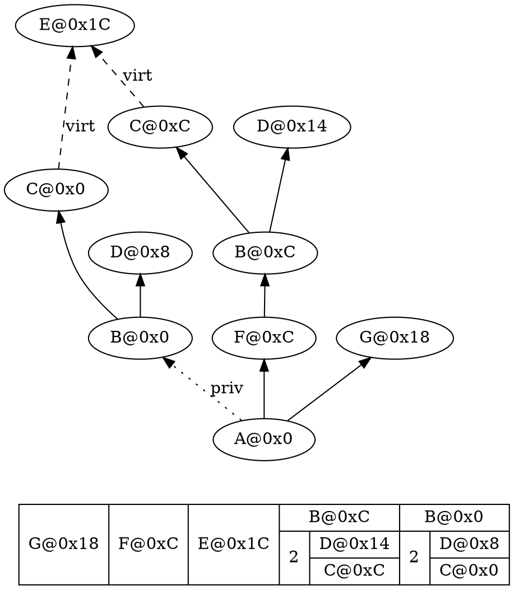

# MWCC and RTTI

## Introduction

MWCC takes a particularly unique approach to type info. First of all, type_info is not polymorphic, and boils down to just the following struct:

```c++
struct type_info {
    const char* name;
    type_info_base_list* baseList;
};
```

In contrast to Itanium, this base list is **not** a list of the class' direct bases with info on their inheritance properties. Instead, it is a flat array of allowed `dynamic_cast` targets, with `type_info_base_list` being defined like this:

```c++
struct type_info_base_list {
    type_info* baseTypeInfo;
    long offset;
};
```

So in a simple hierarchy with basic multiple inheritance, it looks like this:



A's `baseList` has 3 elements, referring to each of the 3 bases respectively since they're all valid `dynamic_cast` cross- or downcast targets.

MWCC's `dynamic_cast` implementation simply loops through this list(after checking if you're not downcasting straight to the most-derived type) checking the requested type against the `type_info` in the list, and if it matches, casts to the type using the offset in the vtable combined with the offset in the base list object.

## Missing bases

If a base is completely unreachable through `dynamic_cast`, it simply does not show up in the list at all:

<table>
<tr>
<th>Private inheritance</th>
<th>Ambiguous base</th>
</tr>
<tr>
<td>



</td>
<td>



</td>
</tr>
</table>

## Restricted casts

Of course, not all `dynamic_cast` targets fall within the always versus never allowed buckets, there are plenty of cases where a cast is only allowed during a direct downcast. For example, in the following hierarchy, `dynamic_cast<C*>` is only allowed when the source subobject is its respective base subobject, `E`.



This new addition to the representation of the base list indicates that `C@0x8` can only be a target for `dynamic_cast` if the source subobject is `E@0x8`, and the same goes for `C@0x4`.

But how is this actually represented in the `type_info_base_list` structure? The answer is that the `offset` member is actually not a full `long`, but only 31 bits large. When the top bit is set, the structure is actually of type `type_info_ambighead`:

```cpp
struct type_info_ambighead {
    type_info* baseTypeInfo;
    long offset;
    long bases;
};
```

This is then followed by an array of `type_info_base_list` entries of size `bases`, after which the next regular entry in the base list follows. In the example above, `bases` will be set to 1 for both `C` entries.

A similar thing happens when private inheritance is involved, since that's the other case where only direct downcasts end up being allowed:



Here `B@0x0` has 3 valid downcast sources, but can't be targeted by a cross-cast from the `C@0x8` branch.

## When MWCC goes wrong

Unfortunately, however clever MWCC's approach may be, they ended up making a few mistakes, causing `dynamic_cast` not to comply with the standard. Both the compiler side and runtime implementation of `dynamic_cast` have issues, allowing invalid casts and disallowing valid ones respectively.

### Working example

To demonstrate these bugs, we're going to start from a slightly more complex example:



### Compiler being overly permissive

First of all, the base list never includes information as to when it's allowed to downcast to the most-derived type, so `dynamic_cast` simply has to assume it's always allowed. Moreover, as you can see in the example above, it will allow crosscasts to unambiguous bases of `A` unconditionally even if another branch has private inheritance.

Seemingly, the compiler writers missed the part where crosscasts(and full downcasts to the most-derived type) are only allowed when the source subobject is a public base subobject. This would explain both the shortcutting of casting to `MDType` and the cross-casting behaviour.

### Runtime being overly restrictive

MWCC's [runtime implementation `__dynamic_cast`](https://github.com/SephDB/pokepark-wii-decomp/blob/fb32ba6ae5276c3b2d05eb96fa68be0ffb75da07/src/sdk/PowerPC_EABI_Support/Runtime/MWRTTI.cpp#L30) has a bug in parsing the `type_info_ambighead` blocks. Instead of checking just the `baseTypeInfo`, it also checks whether the offset(after removing the top bit) matches the source object's offset. This check is wrong to do, but is used correctly further down when checking if the source object matches one of the bases in the ambiguous block.

So downcasting from `C@0xC` to `B` works perfectly, but `D@0x14` to `B` fails since `B@0xC` is at the wrong offset according to the runtime. My best guess is that this never got caught because restricted casts happen only very rarely(you need either private inheritance or ambiguous bases to have the compiler output it in the first place), and even then you need multiple bases(or virtual inheritance) beyond that point to have the offsets mismatch.

I have yet to find any game that both has the ability for this bug to cause an issue in any of its class hierarchies and has actual `dynamic_cast` invocations that could trigger it.
