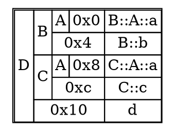

# Non-polymorphic inheritance

As a baseline, let's look at what happens when there's neither virtual functions nor virtual inheritance involved in the inheritance hierarchy.

MWCC does the obvious thing and just plops each class in the inheritance tree down in a declaration order. This layouting algorithm will not change no matter the type of inheritance involved.

Without virtual functions or inheritance involved, there is no difference with Itanium here so I won't be comparing the two for this case. To show the basics of the diagrams I'll be using throughout, here's an example with a few levels of inheritance: 

```cpp
struct A {
    int a;
};

struct B : A {
    int b;
};

struct C : A {
    int c;
};

struct D : B,C {
    int d;
};
```


