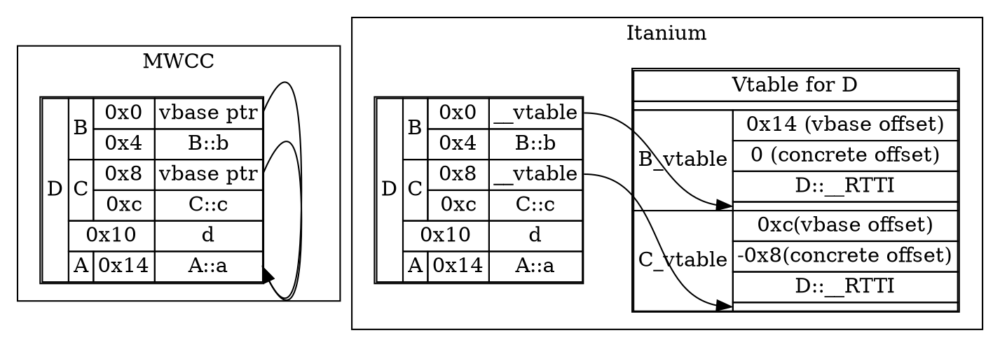
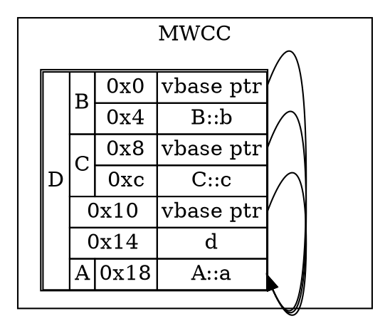

# Virtual inheritance

Things get a lot more interesting when virtual inheritance gets involved. This makes the compiler de-duplicate virtual bases, causing derived-to-base offsets to become dependent on the entire inheritance hierarchy. This has a lot of ramifications, and the different ways MWCC and Itanium solve this offset problem leads to the conclusion about design priorities I outlined in the [first page](index.md).

## No virtual functions

Let's start with our initial example changed just by making B and C inherit virtually from A:

```cpp
struct A {
    int a;
};

struct B : virtual A {
    int b;
};

struct C : virtual A {
    int c;
};

struct D : B, C {
    int d;
};
```



MWCC opts to not output a vtable at all, since there's no virtual functions involved. What it does have, in contrast to Itanium, is pointers to the virtual base, whereas Itanium uses an offset prepended in the respective vtables, one for each virtual base. Meanwhile, MWCC will keep adding vbase pointers into the object layout as more virtual bases are added.

Itanium's prepended list is also partly why its vtable pointers point to the start of the virtual function pointers. The RTTI, concrete offset and the vbase offsets are then just on a list of increasingly negative offsets.

MWCC doesn't deduplicate these virtual base pointers, even if it could. Any class with a direct virtual base will get a vbase pointer added after all non-virtual base class objects, even though any function requiring a vbase pointer will use the first available one(in this case, the one at 0x0, in the B sub-object).

```cpp
struct A {
    int a;
};

struct B : virtual A {
    int b;
};

struct C : virtual A {
    int c;
};

struct D : virtual A, B, C {
    int d;
};
```


