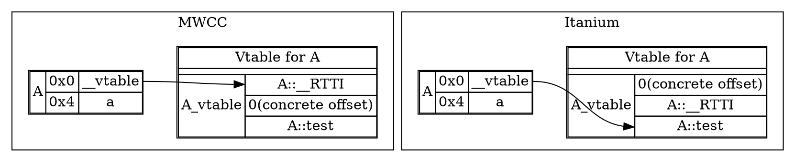
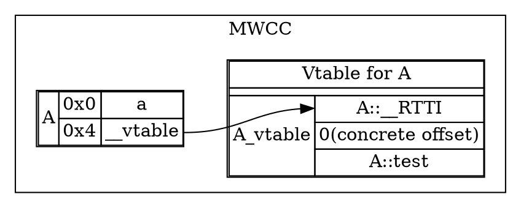
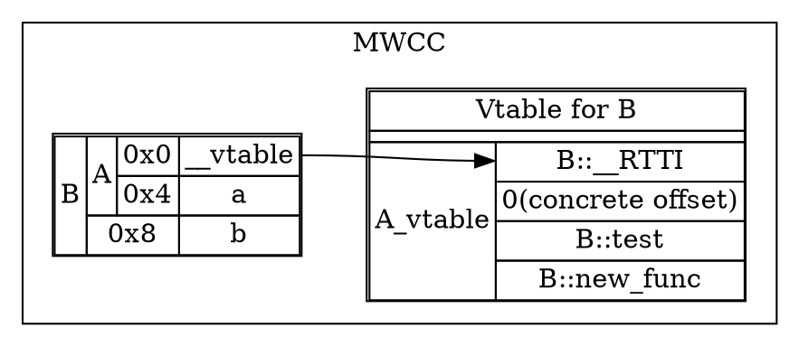
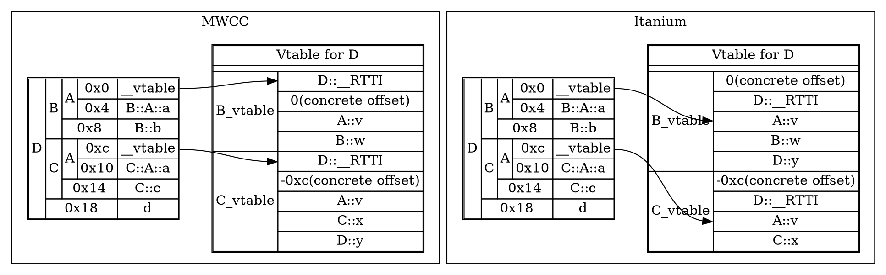
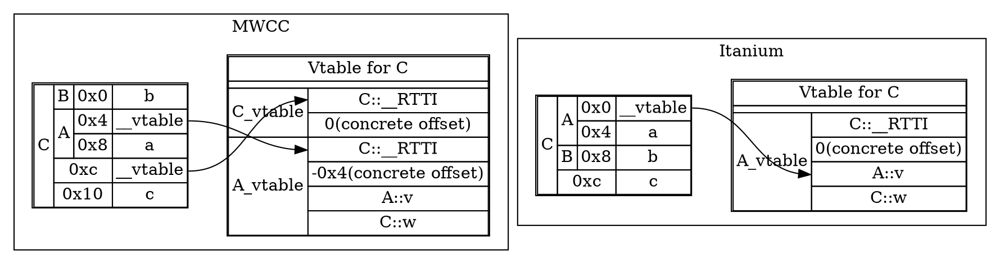

# VTables and non-virtual inheritance

This is where MWCC's ABI start differentiating itself from Itanium. We'll look at the different cases of how vtables get created without virtual inheritance first. 

## Basic example

Let's look at an example vtable without inheritance involved yet:

```cpp
struct A {
    virtual void test();
    int a;
};
```


As you can see, there's a few ordering differences: MWCC has objects' vtable pointers point to the start of the structure, whereas Itanium has them point to the start of the virtual function table within the vtable.

The concrete offset is 0 in simple cases like this, but it'll be relevant in multiple inheritance cases where it gives the offset from the subobject a vtable is part of to the concrete type's position.

In Itanium the vtable pointer is always at the start of an (sub)object, but MWCC has a different algorithm: it puts the vtable pointer in declaration order of the first declared virtual method:

```cpp
struct A {
    int a;
    virtual void test();
};
```


Note how the concrete offset in the vtable remains unchanged, since it is based on the offset from a pointer to the subobject, not the offset of the vtable itself.

## Single Inheritance

```cpp
struct A {
    virtual void test();
    int a;
};

struct B : A {
    void test(); //override
    virtual void new_func();
    int b;
};
```


The vtable pointer of A gets repointed to a version that replaces the pointers to RTTI and test to B's version, and adds B's new_func at the end.

Outside of where the vtable pointer ends up pointing inside the vtable structure, no new difference with Itanium here.

## Multiple inheritance

Taking an example from [Moyang Wang's VTable Notes](https://gist.github.com/moyang/1b7726c6d2df459ef73a717a56a0abfe), let's jump in the deep end with the dreaded non-virtual diamond inheritance pattern:

```cpp
struct A {
    virtual void v();
    int a;
};

struct B : A {
    virtual void w();
    int b;
};

struct C : A {
    virtual void x();
    int c;
};

struct D : B, C {
    virtual void y();
    int d;
};
```


The object layouts are identical, but MWCC adds D's new virtual function to the last vtable instead of the first like Itanium does. Itanium has the concept of a `primary base class`, which is the base class that sits at offset 0 in the object layout of a dynamic class(a class that requires a vtable) and shares its primary vtable pointer. Itanium will re-order the list of bases of a dynamic class to make sure the primary base class exists if possible. MWCC, however, will not:

```cpp
struct A {
    virtual void v();
    int a;
};

struct B {
    int b;
}; //No vtable

struct C : B,A {
    virtual void w();
    int c;
};
```

B is not a dynamic base class, but A is. In Itanium, this makes A the primary base class, and it gets shifted to the front of the direct base class order, enabling the use of A's vtable pointer as C's. MWCC keeps B as the first base, necessitating the introduction of another (empty) vtable to have a primary vtable that has offset 0. This is necessary for dynamic_cast to work correctly, since that looks at the primary vtable to know how much to adjust the pointer by to get to the concrete object.

Note that MWCC still appends C's virtual function `w` to A's vtable.

