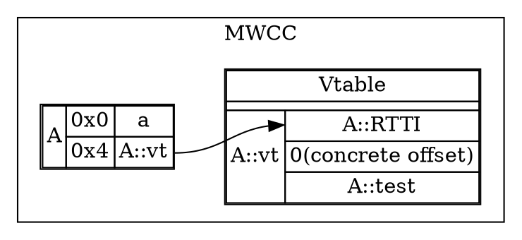

# VTables and non-virtual inheritance

This is where MWCC's ABI start differentiating itself from Itanium. We'll look at the different cases of how vtables get created without virtual inheritance first. 

## Basic example

Let's look at an example vtable without inheritance involved yet:

```cpp
struct A {
    virtual void test() {};
    int a;
};
```
```dot

digraph G {
    rankdir=TB;
    node [shape=none];
    
    subgraph cluster_mwcc {
        label="MWCC";
        {rank=same;
        A [label=<<table cellspacing="0">
            <tr><td rowspan="2">A</td><td>0x0</td><td port="A_vtable">A::vt</td></tr>
            <tr><td>0x4</td><td>a</td></tr>
        </table>>];
        A_vt [label=<<table cellspacing="0">
            <tr><td colspan="2">Vtable</td></tr><tr><td colspan="2"></td></tr>
            <tr><td rowspan="3">A::vt</td><td port="A_RTTI">A::RTTI</td></tr>
            <tr><td>0(concrete offset)</td></tr>
            <tr><td port="A_test">A::test</td></tr>
        </table>>];
        }
        A:A_vtable -> A_vt:A_RTTI:w;
    }

    subgraph cluster_itanium {
        label="Itanium";
        {rank=same
        A2 [label=<<table cellspacing="0">
            <tr><td rowspan="2">A</td><td>0x0</td><td port="A_vtable">A::vt</td></tr>
            <tr><td>0x4</td><td port="A_test">a</td></tr>
        </table>>];

        A_vt2 [label=<<table cellspacing="0">
            <tr><td colspan="2">Vtable</td></tr><tr><td colspan="2"></td></tr>
            <tr><td rowspan="3">A::vt</td><td>0(concrete offset)</td></tr>
            <tr><td port="A_RTTI">A::RTTI</td></tr>
            <tr><td port="A_start">A::test</td></tr>
        </table>>];
        }
        }
        A2:A_vtable -> A_vt2:A_start:w;
    }
}
```

As you can see, there's a few ordering differences: MWCC has objects' vtable pointers point to the start of the structure, whereas Itanium has them point to the start of the virtual function table within the vtable.

The concrete offset is 0 in simple cases like this, but it'll be relevant in multiple inheritance cases where it gives the offset from the subobject a vtable is part of to the concrete type's position.

In Itanium the vtable pointer is always at the start of an (sub)object, but MWCC has a different algorithm: it puts the vtable pointer in declaration order of the first declared virtual method:

```cpp
struct A {
    int a;
    virtual void test() {};
};
```


Note how the concrete offset in the vtable remains unchanged, since it is based on the offset from a pointer to the subobject, not the offset of the vtable itself.